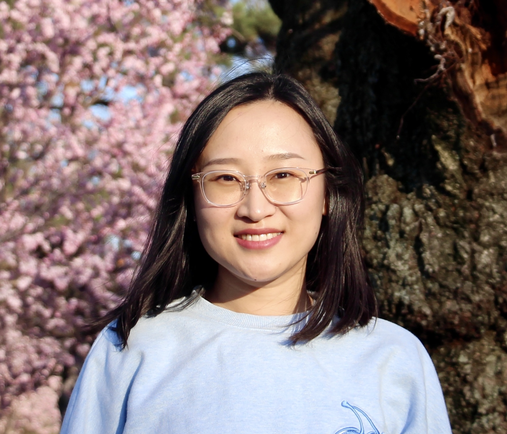

  <body>
    

      

        <h2>刘佳林 Jialin Liu, Ph.D.</h2>
           
Visiting scholar at UMass Amherst; Incoming Ph.D. student at Duke University

      

      

          
          

          
I am a visiting scholar at UMass Amherst, working with Professor <a href="https://people.cs.umass.edu/~jxiong/">Jie Xiong</a>. I will be joining Duke University this fall to pursue my second Ph.D. degree in Electrical and Computer Engineering. I will be working with Professor <a href="https://ece.duke.edu/faculty/yiran-chen">Yiran Chen</a> and Professor <a href="https://tingjunchen.com">Tingjun Chen</a> on AI-driven wireless networking.

          
I received my Ph.D. degree in Software Engineering from Dalian University of Technology in 2022 (advisor: Professor <a href="http://faculty.dlut.edu.cn/leiwang">Lei Wang</a>).

          

          
Email: jialinliu at umass.edu | jialin.liu at duke.edu

          
Interests: Wireless Sensing & Networking; Mobile Computing

          
<a href="https://scholar.google.com/citations?user=57GlfUQAAAAJ&hl=zh-CN">Google Scholar</a> | <a href="https://www.linkedin.com/in/jialin-liu-04221a223/">LinkedIn</a> | <a href="Jialin_CV.pdf">CV</a>

          

      

      

      <h3>News</h3>
      <li><b>07/2022</b>  Our paper <i>SonicBot</i> was accepted at IMWUT (UbiComp '22).</li>
      <li><b>06/2022</b> Serve as the Shadow PC on SenSys '22.</li>
      <li><b>06/2022</b> I passed my final defense! I am grateful to Prof. Lei Wang and Prof. Jie Xiong for their advising. 🎓</li>
      <li><b>03/2022</b> I will be joining Duke ECE as a Ph.D. student this fall. </li>
      <li><b>01/2022</b>  Our paper <i>LASense</i> was accepted at IMWUT (UbiComp '22).</li>
      <li><b>01/2022</b>  Our paper <i>MOM</i> was accepted at IPSN '22.</li>
      

      <h3>Selected Publications (<a href="https://scholar.google.com/citations?user=57GlfUQAAAAJ&hl=zh-CN">Full List</a>)</h3>
      
<a href="papers/IMWUT21-LASense.pdf">LASense: Pushing the Limits of Fine-grained Activity Sensing Using Acoustic Signals</a> 
      Dong Li, <b>Jialin Liu</b>, Sunghoon Ivan Lee, Jie Xiong  
      ACM IMWUT/UbiComp 2022
      

      
<a href="papers/IPSN22_MOM.pdf">MOM: Microphone based 3D Orientation Measurement</a> 
      Zhihui Gao, Ang Li, Dong Li, <b>Jialin Liu</b>, Jie Xiong, Yu Wang, Bing Li, Yiran Chen 
      ACM/IEEE IPSN 2022
      

      
<a href="papers/IMWUT21-BlinkListener.pdf">BlinkListener: “Listen” to Your Eye Blink Using Your Smartphone </a> 
      <b>Jialin Liu</b>, Dong Li, Lei Wang, Jie Xiong  
      ACM IMWUT/UbiComp 2021
      

      
<a href="papers/SenSys20-FM-Track.pdf">FM-Track: Pushing the Limits of Contactless Multi-target Tracking using Acoustic Signals </a> 
      Dong Li, <b>Jialin Liu</b>, Sunghoon Ivan Lee, Jie Xiong  
      ACM SenSys 2020
      

      

      <a href="https://www.mdpi.com/1424-8220/18/10/3379">Multi-Target Intense Human Motion Analysis and Detection Using Channel State Information</a>  
      <b>Jialin Liu</b>, Lei Wang, Jian Fang, Linlin Guo, Bingxian Lu, Lei Shu 
      Sensors 2018
      

      

      <a href="https://ieeexplore.ieee.org/abstract/document/8210800">A Research on CSI-based human Motion Detection in Complex Scenarios</a> 
      <b>Jialin Liu</b>, Lei Wang, Linlin Guo, Jian Fang, Bingxian Lu, Wei Zhou 
      IEEE HealthCom 2017
      

      

      <h3>Services</h3>
      <li>Shadow Program Committee, SenSys 2022</li>
      

      <h3>Honors & Awards</h3>
      <li>Duke ECE Diversity Award, 2022</li>
      <li>CSC Scholarship, 2019</li>
      <li>China Graduate Contest on Application, Design and Innovation of Mobile-Terminal, Second Prize, 2017</li>
      <li>China National Scholarship of Graduates, 2015</li>
      <li>Mitsubishi Chemical Scholarship, 2013</li>
      

      
Last update: July 11, 2022

    
 
    
  </body>